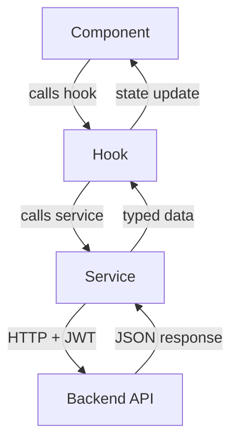
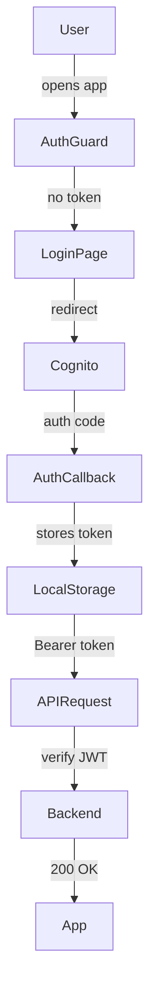
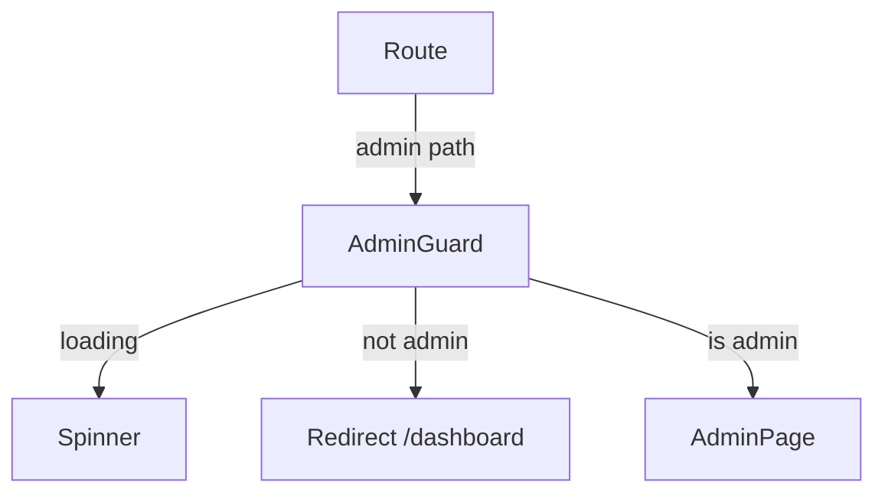

# Architecture

Vault Vibes uses a **feature-based architecture** — each domain area owns its pages and components, while shared code lives in common layers.

---

## Folder layout

```
src/
├── app/               # Bootstrap, routing, global providers
│   ├── App.tsx        # Root — auth guards, routes
│   ├── providers.tsx  # AppProviders wrapper
│   └── context/
│       └── AppContext.tsx   # Global state: current user, modals, dark mode
├── auth/              # Cognito auth provider, guards, permissions
├── features/          # One folder per domain
│   ├── dashboard/
│   ├── shares/
│   ├── pool/
│   ├── ledger/
│   ├── loans/
│   ├── distribution/
│   ├── admin/
│   ├── account/
│   ├── invitations/
│   └── notifications/
├── components/
│   ├── cards/         # Reusable summary cards
│   ├── layout/        # Sidebar, Topbar, MobileNav, DashboardLayout
│   └── ui/            # shadcn/Radix primitives
├── hooks/             # Data-fetching hooks (useLoans, useDashboardData, etc.)
├── services/          # API calls (api.ts + one service per domain)
├── utils/             # Formatting helpers (currency, date, financial)
├── types/             # Shared TypeScript types
└── config/            # Feature flags, constants
```

---

## Request flow



---

## Authentication flow



---

## Admin guard



---

## State management

Global state lives in `AppContext` — only what multiple features need:

| State | Purpose |
|-------|---------|
| `currentUser` | Logged-in member data (name, shares, role) |
| `isUserLoading` | Whether user data is still loading |
| `isDarkMode` | Dark/light toggle |
| `isContributionModalOpen` | Controls the contribution modal |
| `isLoanModalOpen` | Controls the loan request modal |

Page-level data (loans, pool stats, ledger) is fetched via hooks inside each feature.
