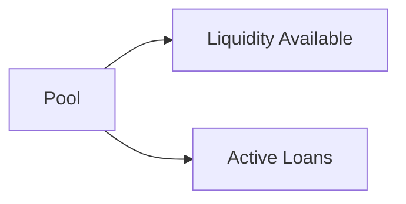

# Calculations

How the numbers work in Vault Vibes.

---

## Core formulas

### Per Share Value
```
Per Share Value = Pool Total Balance ÷ Shares Sold
```
The pool grows as contributions come in, loans earn interest, and bank interest is recorded. Every share tracks this growth.

### Member Value (current)
```
Member Value = Shares Owned × Per Share Value
```
What a member's stake is worth right now.

### Profit
```
Profit = Member Value − Paid So Far
```
How much a member has earned above what they've contributed. Can be negative early in the cycle.

### Contribution Progress
```
Progress % = Paid So Far ÷ Total Commitment × 100
```
Capped at 100%. Shown as a progress bar on the admin view.

---

## Pool composition

The pool has two components:

| Component | Description |
|-----------|-------------|
| Liquidity Available | Cash on hand — ready to lend or distribute |
| Active Loans | Money currently lent out to members |

```
Pool Total Balance = Liquidity Available + Active Loans Value
```



---

## Loan calculations

When a loan is issued:

```
Interest = Principal × (Interest Rate / 100)
Total Repayment = Principal + Interest
```

All loans must be repaid by end of the month issued.

---

## Year-end projection

The projection estimates the pool value at distribution date:

```
Projected Pool = Current Pool
              + (Monthly Contribution × Months Remaining)
              + Expected Loan Interest
              + Projected Bank Interest
```

Then:
```
Projected Per Share Value = Projected Pool ÷ Shares Sold
Projected Member Payout   = Shares Owned × Projected Per Share Value
Projected Gain            = Projected Payout − Paid So Far
```

Bank interest is estimated from the 3-month rolling average of recorded interest entries.

---

## Loan exposure warning

A warning is shown when:
```
(Active Loans Value ÷ Pool Total Balance) × 100 > 50%
```

High loan exposure means less liquidity for new loans and potential distribution risk.

---

## Where these live in code

| Formula | Location |
|---------|---------|
| Per share value | Derived from `pool.perShareValue` (API computed) |
| Member value | `currentUser.sharesOwned × pool.perShareValue` |
| Profit | `memberValue − currentUser.paidSoFar` |
| Progress % | `safeDivide(paid, total) × 100` |
| Loan interest | `amount × (rate / 100)` |
| Projection | `PoolService.getProjection()` via backend |
