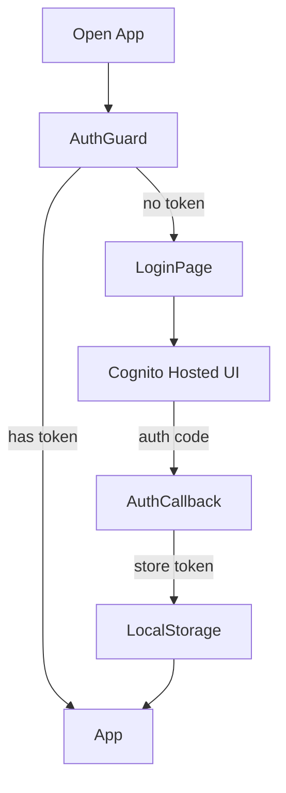
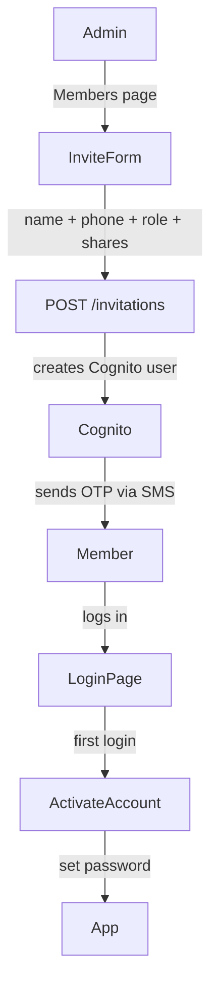
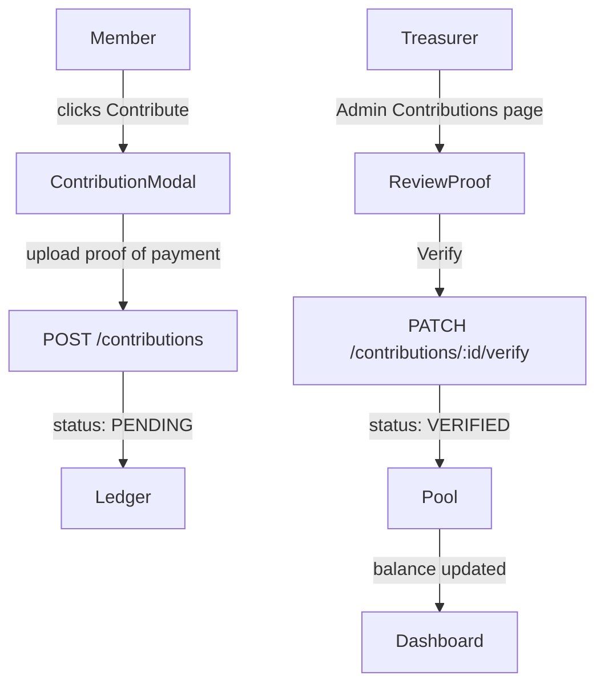
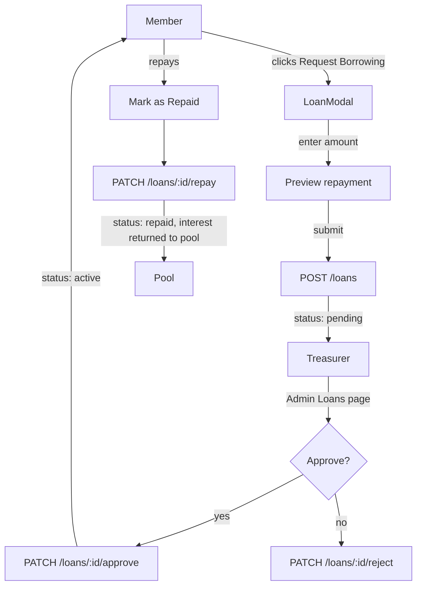
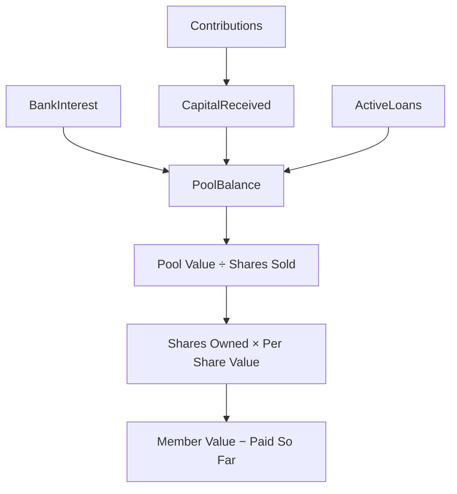
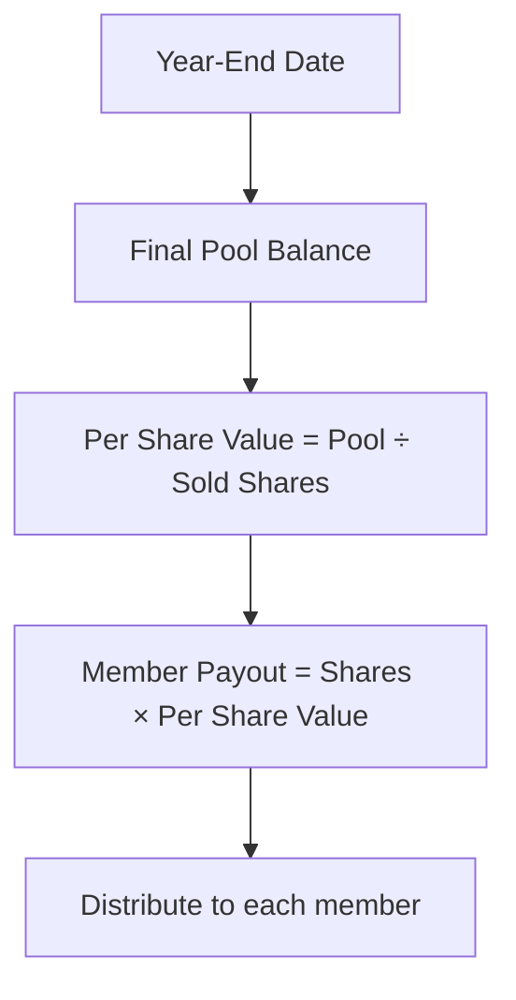

# User Flows

Key journeys through the app - from login to year-end payout.

---

## Login

---

## Invite a new member

---

## Make a contribution

---

## Request a loan

---

## Dashboard calculation flow

---

## Year-end distribution

