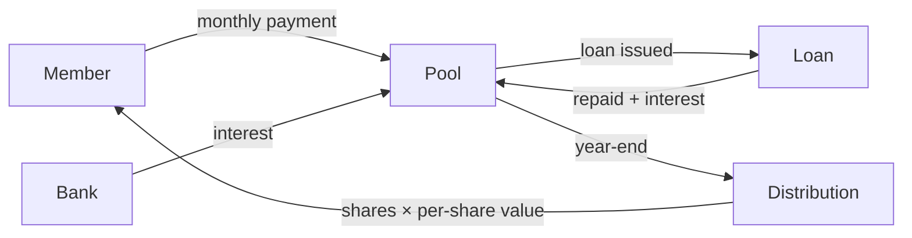

# Vault Vibes - Overview

Vault Vibes is a digital stokvel platform. Members pool money together, buy shares, earn interest, and borrow from the group. At year-end, the pool is distributed based on how many shares each member holds.

---

## What it does

```
Members contribute monthly
        ↓
Money flows into the pool
        ↓
Pool earns value through interest and loan repayments
        ↓
Each share is worth pool value ÷ total shares
        ↓
At year-end, members get paid out based on shares owned
```

---

## Who uses it

| Role | What they do                                              |
|------|-----------------------------------------------------------|
| Member | View their shares, contribute, request loans              |
| Treasurer | Verify contributions, approve loans, record bank interest |
| Chairperson | Same as treasurer - group governance focus                |
| Admin | Full system access                                        |

---

## Core features

- **Dashboard** - see your shares, estimated value, and recent activity
- **Shares** - group ownership breakdown by member
- **Pool** - live pool balance, liquidity, and loan exposure
- **Ledger** - searchable transaction history
- **Loans** - request borrowing, track repayments
- **Distributions** - projected year-end payout for all members
- **Admin** - manage members, verify contributions, approve loans, configure the stokvel

---

## How the money flows


